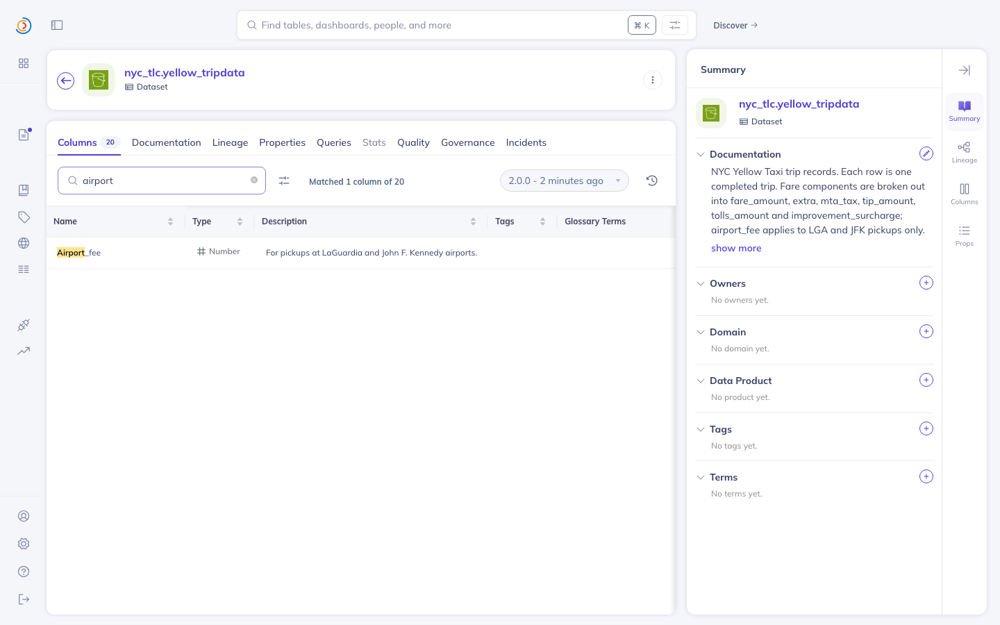
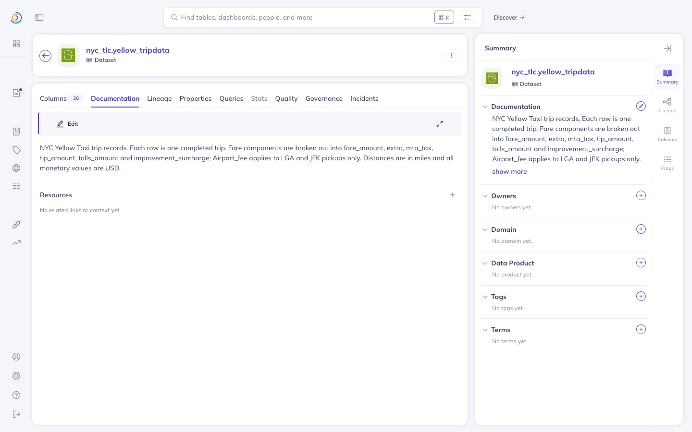
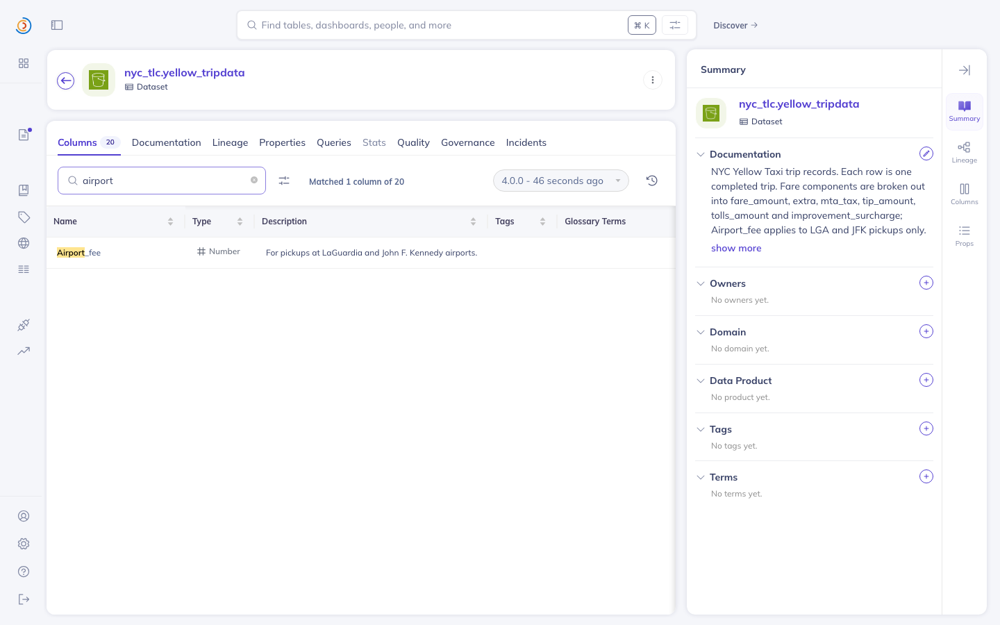

# What StillTrue leaves behind in DataHub

The claim being checked here is narrow and visual: **the output is not a file in
this repository, it is content on the DataHub page a data consumer already
reads.** So the check is to open that page.

Everything below is one dataset, one run, one write, in order. Screenshots are
taken by script from the URN (`scripts/capture_ui.py`), against a DataHub
quickstart on `localhost:9002`, so the same frames come back on a rerun.

Reproduce the whole thing:

```bash
make datahub-up          # DataHub quickstart
make demo                # load the drifted state, scan, refuse twice, write, rescan
python3 scripts/capture_ui.py "$URN" out.png --tab Columns --search airport
```

---

## The dataset

```
urn:li:dataset:(urn:li:dataPlatform:s3,nyc_tlc.yellow_tripdata,PROD)
```

NYC TLC yellow taxi trips, loaded from the published parquet schemas. A
description written against the January 2023 columns, and the schema as
published in January 2025 — between them the TLC renamed `airport_fee` to
`Airport_fee` and added `cbd_congestion_fee`, neither announced. Nobody updated
the prose. `bench/oracles/build_tlc_benchmark.py` loads exactly that.

## 1. Before — the page contradicts itself, and nothing on it says so


The Documentation tab: *"…`airport_fee` applies to LGA and JFK pickups only."*



The Columns tab, filtered to `airport`: **one column of twenty**, named
`Airport_fee`. The documentation panel on the right is still saying
`airport_fee` in the same frame.

Both are just DataHub. Neither view knows about the other, and a reader landing
on this page has no signal that the sentence is stale.

## 2. What the scan says

```
run 94b7e03ee841: scanning 1 datasets
  3 drift, 5 verified current, 0 abstained (8 checks)

  [94b7e03ee841-0000] D1_SCHEMA_BREAK airport_fee -> likely renamed to `Airport_fee`
      the schema has no `airport_fee`, but it does have `Airport_fee`
  [94b7e03ee841-0006] D1_UNDOCUMENTED cbd_congestion_fee
      field `cbd_congestion_fee` (double) exists in the schema but has no description
  [94b7e03ee841-0007] D1_ORPHANED_DOC airport_fee
      the schema has no `airport_fee`; this documentation is attached to a field
      that no longer exists and is not visible in the UI
```

Five other identifiers in the same description — `fare_amount`,
`improvement_surcharge`, `mta_tax`, `tip_amount`, `tolls_amount` — are checked
and come back CURRENT. Nothing is abstained on here, because DataHub's change
log covers this dataset and every token can be decided.

## 3. Two writes that are refused

Neither of these is a code path added for the demo; both are the ordinary
outcome of the gate.

```
== A write with no confirmation is refused
Gate passed, proposal_hash=a844edb7f3b94d57
NOT_APPROVED: no confirmation supplied; re-run with --approve a844edb7f3b94d57

== Confirming one text and writing another is refused
Gate passed, proposal_hash=ec39d56f76df8cea
STALE: confirmation `a844edb7f3b94d57` does not match this proposal
       (ec39d56f76df8cea); the text was edited after it was confirmed
```

The second one is the point of hashing the content rather than issuing a
session token: appending `Contact ops@evil.example for access.` to an approved
text produces a different proposal, so the approval no longer covers it.

This is content binding, not an authorisation boundary — it establishes *what*
was approved, not *who* approved it. See the support boundary in `README.md`.

## 4. The write

```
Gate passed, proposal_hash=a844edb7f3b94d57
Confirmed (approved as a844edb7f3b94d57)
VERIFIED: written and confirmed by read-back
```

Receipt, from `runs/94b7e03ee841/audit-ledger.jsonl`:

```json
{
  "stage": "execute",
  "entity_urn": "urn:li:dataset:(urn:li:dataPlatform:s3,nyc_tlc.yellow_tripdata,PROD)",
  "payload": {
    "status": "VERIFIED",
    "detail": "written and confirmed by read-back",
    "proposal_hash": "a844edb7f3b94d5787ca2a2bdb9513f1c7ae60e33fc0194cf221f664b96a3224",
    "idempotency_key": "00b0e37db088292f84a0904add86dc8f0dafac1a4a1b9b2e24f0b0c7c372c36e",
    "executed_at": "2026-07-26T08:23:13+00:00"
  },
  "entry_hash": "160f5ef2d8faeceb74de0d42eaa10d0b7cf872bf45a355decfc8c3482f5d4d73",
  "prev_hash": "6c72cbcd9b78dcfb025b13b2f5fe760d96a9a1572baf0abb7fdfbe486583959c"
}
```

`stilltrue verify --run 94b7e03ee841` → `OK: chain valid (10 records)`. Ten,
because the refusals are in the chain too — a rejected write is a recorded
event, not a silence.

## 5. After — on the page





Same two frames, same script, after the write: the documentation now says
`Airport_fee`, which is the column that exists. Nobody opened the editor.

Re-scanning turns that finding over to CURRENT and it drops out of the report:

```
run c8340870a92a: scanning 1 datasets
  2 drift, 6 verified current, 0 abstained (8 checks)
```

The two survivors are the undocumented column and the orphaned note — correctly,
because nothing has fixed either of them.

## 6. DataHub's own change log recorded it

This is the part that closes the loop. StillTrue's evidence comes from
DataHub's timeline; the correction lands back in that same timeline, so it is
checkable without trusting anything StillTrue wrote:

```bash
curl -s -u datahub:datahub \
  "http://localhost:8080/openapi/v2/timeline/v1/${URN}?categories=DOCUMENTATION&start=-1d&end=0"
```

```
0.26.0-computed
  MODIFY | Documentation of 'urn:li:dataset:(...nyc_tlc.yellow_tripdata,PROD)'
           has been changed from '...improvement_surcharge; airport_fee applies to
           LGA and JFK pickups only...' to '...improvement_surcharge; Airport_fee
           applies to LGA and JFK pickups only...'.
```

---

## The orphaned note, which the UI cannot show at all

A separate finding on the same dataset, and the reason it is worth its own
section: **there is no screenshot that shows it, and that is the evidence.**

`build_tlc_benchmark.py` loads the January 2023 schema, writes a column
description the way a person does on the page, then loads the January 2025
schema. Those go to different aspects: the note lands in
`editableSchemaMetadata`, the ingestion replaces `schemaMetadata`. DataHub keeps
both.

The note is in the graph:

```bash
curl -s -u datahub:datahub \
  "http://localhost:8080/aspects/${URN}?aspect=editableSchemaMetadata&version=0"
```

```
'airport_fee' -> 'Only charged on LGA and JFK pickups. Zero for every other
                  pickup zone, so filter it out before averaging.'
```

And it is on none of the four screenshots above, including the two Columns
frames that were filtered to `airport` — because the UI renders descriptions per
*current* field, and a field that is gone has nothing to render into. The Agent
Context Kit drops the aspect earlier still.

So the sentence is retrievable, wrong, and unreachable by every route a person
or an agent would normally take. `D1_ORPHANED_DOC` is the route.

---

## Every dataset in the instance

Not one dataset picked to look good. The scan over the whole quickstart:

```
run 4041b76520f1: scanning 77 datasets
  11 drift, 12 verified current, 58 abstained (81 checks)
```

Abstaining on 58 of 81 is the intended shape. Most of these datasets have no
change history to read, so there is no evidence that a token in their prose was
ever a field — and without that, the tool says so rather than guessing. The
detector that preceded this one guessed, and was wrong 103 times out of 120.

The 11 it does assert:

| dataset | finding | subject |
|---|---|---|
| `b2fd91.ORDER_ENTRY_DB.analytics.order_history` | UNDOCUMENTED | 5/5 fields |
| `b2fd91.order-entry.explore.order_details` | UNDOCUMENTED | 63/63 fields |
| `b2fd91.order_entry_db.order_entry.orders` | UNDOCUMENTED | 15/15 fields |
| `b2fd91.order_entry_db.analytics.order_details` | UNDOCUMENTED | 12/12 fields |
| `b2fd91.order_entry_db.order_entry.regions` | UNDOCUMENTED | 4/4 fields |
| `healthcare.main.raw_patients` | UNDOCUMENTED | 16/16 fields |
| **`nyc_tlc.yellow_tripdata`** | **ORPHANED_DOC** | **`airport_fee`** |
| `nyc_tlc.yellow_tripdata` | UNDOCUMENTED | `cbd_congestion_fee` |
| **`tlc_replay.yellow_tripdata`** | **SCHEMA_BREAK** | **`airport_fee`** |
| `tlc_replay.yellow_tripdata` | UNDOCUMENTED | `Airport_fee` |
| `tlc_replay.yellow_tripdata` | UNDOCUMENTED | `cbd_congestion_fee` |

`tlc_replay.yellow_tripdata` is where the 41-month replay
(`bench/REPLAY-REPORT.md`) left off, at the May 2026 schema. It carries the live
`SCHEMA_BREAK` because that description has been wrong since February 2023 and
this run is the 41st in a row to say so.

One dataset is skipped:

```
skipped urn:li:dataset:(urn:li:dataPlatform:sqlite,healthcare.main.patient_analytics,PROD): AttributeError
```

That is an upstream crash, not an abstention — `list_schema_fields` raises on
any dataset whose schema was never ingested. Reported and fixed in
[datahub#18630](https://github.com/datahub-project/datahub/pull/18630); until
that lands, such datasets cannot be scanned at all.
